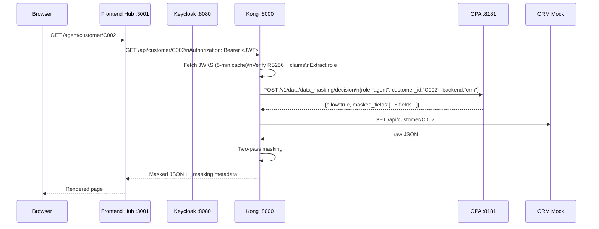
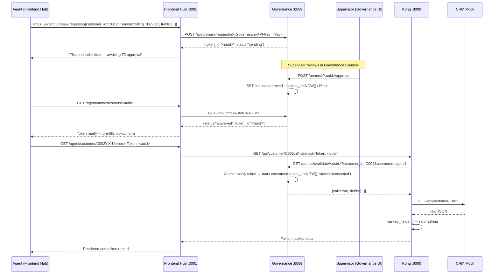
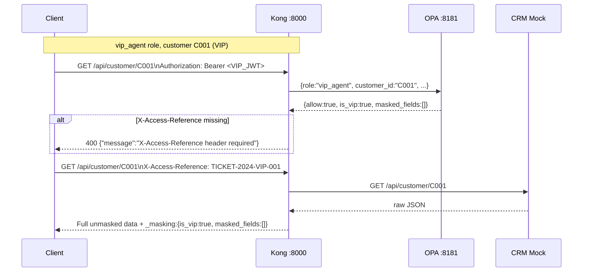
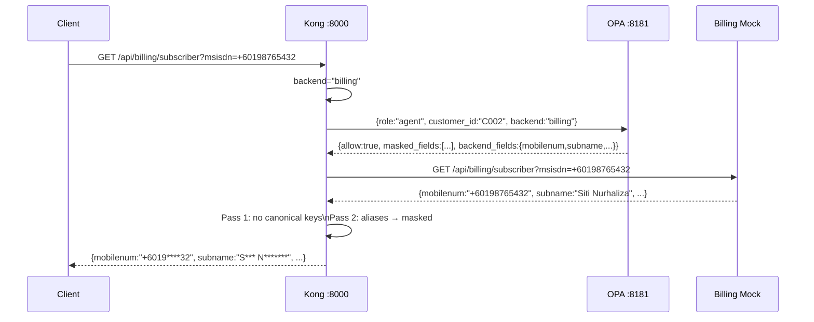
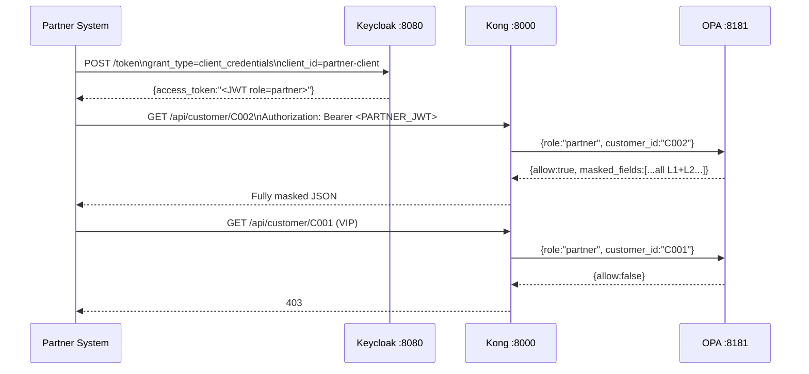

# Data Masking PoC — Keycloak · Kong · OPA · Identity Governance · File · Kafka · DW/Lake

A self-contained Docker Compose stack demonstrating **role-based PII masking enforced across
multiple integration channels**: API gateway (Kong), batch file processing, Kafka streaming events,
and data warehouse / lake / mart exports. All channels share a single OPA bundle as the masking
policy source of truth, combined with an **identity governance layer** (access requests, access
reviews, separation-of-duties, T1/T2 unmask approval) and a **multi-app frontend hub** with
per-application OIDC clients and app-role enforcement.

---

## Table of contents

1. [Architecture](#architecture)
2. [How it works end-to-end](#how-it-works-end-to-end)
3. [Sequence diagrams](#sequence-diagrams)
4. [Data classification](#data-classification)
5. [Multi-backend field alias support](#multi-backend-field-alias-support)
6. [Role-based masking policy](#role-based-masking-policy)
7. [Customer tier ABAC](#customer-tier-abac)
8. [Context signals](#context-signals)
9. [VIP customer controls](#vip-customer-controls)
10. [Partner role](#partner-role)
11. [File and batch masking](#file-and-batch-masking)
12. [Kafka streaming masking](#kafka-streaming-masking)
13. [Data warehouse / lake / mart masking](#data-warehouse--lake--mart-masking)
14. [Shared masking SDK](#shared-masking-sdk)
15. [Services](#services)
16. [Portals and credentials](#portals-and-credentials)
17. [Quick start](#quick-start)
18. [Demo users](#demo-users)
19. [Test data](#test-data)
20. [API reference](#api-reference)
21. [Sample requests and responses](#sample-requests-and-responses)
22. [OPA policy internals](#opa-policy-internals)
23. [Identity governance](#identity-governance)
24. [Frontend hub](#frontend-hub)
25. [Admin GUI](#admin-gui)
26. [Component map](#component-map)
27. [Startup order](#startup-order)
28. [Production notes](#production-notes)

---

## Architecture

```
┌──────────────────────────────────────────────────────────────────────────────┐
│  Browser / API Client                                                        │
│    │  1. OIDC login (auth-code flow, per-app client) or client_credentials  │
│    ▼                                                                         │
│  Keycloak :8080  ──  issues RS256-signed JWTs  ──  backed by Postgres       │
│                                                                              │
│  ┌────────────────────────────────────────────────────────────────────────┐  │
│  │  Frontend Hub :3001  (multi-app OIDC hub, Flask + Authlib)            │  │
│  │  Five per-app OIDC clients: agent-portal, supervisor-dashboard,       │  │
│  │  fraud-console, audit-viewer-app, partner-api                         │  │
│  │    │  Bearer <JWT> on every backend call                              │  │
│  └────────────────────────┬───────────────────────────────────────────────┘  │
│                           │  (also: Website :3000 — standalone OIDC portal) │
│                           ▼                                                  │
│  Kong Gateway :8000  (DB-less, Lua serverless plugins)                      │
│    │  Verify JWT RS256 · Call OPA · Mask response fields (2-pass Lua)      │
│    │      ├─► CRM Mock     (canonical field names)                         │
│    │      └─► Billing Mock (aliased field names)                           │
│    ▼                                                                         │
│  Masked JSON → rendered in browser                                          │
│                                                                              │
│  ── NEW: Non-API masking channels (all share same OPA bundle policy) ──     │
│                                                                              │
│  Admin GUI :8888  ──  File/Batch masking                                    │
│    POST /api/mask/batch   JSON records → masked JSON (API key auth)         │
│    GET/POST /mask/file    CSV / JSON / Parquet upload → masked download     │
│                                                                              │
│  Kafka Masker  (kafka-masker container)                                     │
│    Consumes  raw.customer.events  (Redpanda :9092)                          │
│    Headers: X-Role, X-Customer-Id → OPA decision → apply masking           │
│    Publishes masked.customer.<role>  (one output topic per role)            │
│    Dead-letter queue: dlq.masking.errors                                    │
│                                                                              │
│  DW / Lake / Mart Masker :5003                                              │
│    POST /views/refresh  → masked SQL VIEWs in PostgreSQL (one per role)    │
│    POST /export         → masked Parquet files in MinIO :9000/:9001         │
│    POST /marts/build    → mart schemas (mart_care, mart_billing, etc.)     │
│                                                                              │
│  Admin GUI :8888  ──  policy config stored in PostgreSQL :5432              │
│    Customer tiers · role-field matrix · backend field registry              │
│    Application registry · app-role grants                                   │
│    User lifecycle (onboard / role-change / offboard via Keycloak Admin API) │
│    Served as OPA bundle  GET /bundle/masking_config.tar.gz                  │
│    OPA polls every 15–60 s — no manual push needed                          │
│                                                                              │
│  Governance Service :8889  ──  Identity Governance (MS Entra-style)         │
│    Role requests · Access reviews · Separation-of-Duties rules             │
│    T2 unmask approval gate + T1 token hygiene (15-min, single-use)         │
│    Self-service portal at /portal  (Keycloak OIDC login)                   │
└──────────────────────────────────────────────────────────────────────────────┘
```

### Key design decisions

| Decision | Reason |
|---|---|
| JWT RS256 verified in Kong via JWKS | Full cryptographic signature check — no per-request Keycloak round-trip; JWKS cached 5 min per Kong worker; key rotation handled by invalidating cache on unknown `kid` |
| OPA for masking decisions | Policy as code, live updates via Admin GUI without gateway restart |
| Admin service as OPA bundle server | VIP list and masking rules are operational config, not code — served as a versioned gzip tarball; OPA polls every 15–60 s |
| Customer tier ABAC | Four tiers (standard / premium / vip / risk) replace the old VIP boolean; tier-aware OPA rules restrict which roles can access which customers |
| App-role gate | Each registered application carries an allowed-role list; OPA enforces it so a user with a valid token cannot access an app their role isn't registered for |
| T1/T2 unmask security | T2: agent submits request via governance portal → supervisor approves → token issued. T1: token is single-use, 15-min TTL, bound to requesting user + customer. Prevents self-approval by design |
| PostgreSQL for all stateful services | Keycloak, Admin Service, and Governance Service all share one Postgres instance with separate databases (`keycloak`, `admindb`) |
| Backend field alias registry | One role × field matrix applies across all backends; alias mapping is data, not code |
| Two-pass Lua masking | Pass 1 for canonical names, Pass 2 for backend-specific aliases with double-masking guard |
| Non-blocking audit log | `log_event` runs in a daemon thread to prevent gateway timeouts — no synchronous call to an external log endpoint on the hot path |

---

## How it works end-to-end

Every request through Kong goes through a fixed pipeline of three phases.

### Phase 1 — Pre-function (access control, `kong.yml` → `pre-function`)

1. **Extract Bearer token** from `Authorization` header — 401 if missing.
2. **Verify JWT RS256 signature** — fetch JWKS from `KEYCLOAK_INTERNAL_URL/realms/KEYCLOAK_REALM/protocol/openid-connect/certs`, cache per Kong worker for 5 minutes. Match `kid`; on unknown `kid` invalidate cache and re-fetch once. Convert the matching JWK to PEM via `resty.openssl.pkey`, then:
   - **Realm check**: verify `iss` contains `/realms/demo`.
   - **Signature check**: call `resty.jwt:verify_jwt_obj` with `lifetime_grace_period=10`.
3. **Pick highest-priority role** from `realm_access.roles`.
4. **Detect backend** from path prefix (`/api/billing/*` → `"billing"`, else → `"crm"`).
5. **Resolve MSISDN → customer_id** (for MSISDN-based routes) by calling CRM `/api/resolve`.
6. **Inject context signals** from request headers into `input.ctx` — `initiated_by`, `channel`, `session_type`, `purpose`, working-hours flag.
7. **Call OPA** with `{role, username, path, method, customer_id, backend, ctx}`. Receive `{allow, masked_fields, is_vip, backend_fields}`.
8. **Enforce VIP rule**: if `is_vip=true` and `X-Access-Reference` header is missing → 400.
9. **Enforce unmask rule**: `/api/unmask/*` requires a valid `X-Unmask-Token` header. Kong calls `GET governance:8889/unmask/validate/<token>?customer_id=…&username=…`. Token must exist, be approved, not expired (15 min), not consumed, and be bound to the requesting user. On first valid use the token is atomically marked `consumed` (prevents replay).
10. Store shared context (`masked_fields`, `backend_fields`, `user_role`, `is_vip`, …) in `kong.ctx.shared`.

### Phase 2 — Post-function (response masking, `kong.yml` → `post-function`)

Buffer the full response body, then:

1. **Pass 1** — mask canonical field names listed in `masked_fields`.
2. **Pass 2** — iterate `backend_fields` (alias registry from OPA). For each alias where `backend_field != canonical_field` and the canonical is in `masked_fields`, apply the same masking function.
3. Append `_masking` metadata object to the JSON response.
4. Fire async audit log event (daemon thread — does not block response).

---

## Sequence diagrams

### 1. Standard CRM request



### 2. T2 unmask flow (full governance gate)



### 3. VIP customer access



### 4. Billing subscriber lookup (alias masking)



### 5. Partner / M2M flow



---

## Data classification

| Field (canonical) | Class | Masking function | Example output |
|---|:---:|---|---|
| `name` | L1 | First letter per word, rest starred | `A**** b** A*******` |
| `msisdn` | L1 | Country prefix + last 2 digits | `+6019****32` |
| `email` | L1 | First + last char of local part | `s***i@email.com` |
| `national_id` | L1 | First 2 chars | `92************` |
| `address` | L1 | Full redact | `*** (redacted)` |
| `last_call_duration` | L2 | Full redact | `***` |
| `data_roaming_gb` | L2 | Full redact | `***` |
| `last_location` | L2 | Full redact | `***` |

---

## Multi-backend field alias support

Different backend systems may name the same PII concept differently. The alias registry in the
Admin GUI maps backend-specific field names to canonical names, allowing the same role × field
masking matrix to apply across all backends.

### Billing field alias map

| Billing field | Canonical field | Classification |
|---|---|---|
| `mobilenum` | `msisdn` | L1 |
| `subname` | `name` | L1 |
| `ic_num` | `national_id` | L1 |
| `billing_address` | `address` | L1 |
| `call_duration_s` | `last_call_duration` | L2 |
| `roaming_gb` | `data_roaming_gb` | L2 |

Adding a new backend only requires registering its field mappings in the Admin GUI.

---

## Role-based masking policy

Masking rules are live-configurable via the Admin GUI at `/roles`. Defaults for key roles:

| Field | agent | care\_l1 | care\_l2 | care\_sup | supervisor | billing\_agent | fraud\_analyst | vip\_agent | admin | partner |
|---|:---:|:---:|:---:|:---:|:---:|:---:|:---:|:---:|:---:|:---:|
| `name` | ● | ● | ● | ● | ○ | ○ | ○ | ○ | ○ | ● |
| `msisdn` | ● | ● | ● | ○ | ● | ○ | ○ | ○ | ○ | ● |
| `email` | ● | ● | ● | ○ | ○ | ○ | ○ | ○ | ○ | ● |
| `national_id` | ● | ● | ● | ● | ● | ○ | ○ | ○ | ○ | ● |
| `address` | ● | ● | ○ | ○ | ○ | ○ | ○ | ○ | ○ | ● |
| `last_call_duration` | ● | ● | ● | ○ | ○ | ○ | ○ | ○ | ○ | ● |
| `data_roaming_gb` | ● | ● | ● | ○ | ○ | ● | ○ | ○ | ○ | ● |
| `last_location` | ● | ● | ● | ● | ○ | ○ | ○ | ○ | ○ | ● |

● = masked  ○ = clear (exact matrix is managed in the Admin GUI)

---

## Customer tier ABAC

Four customer tiers replace the old VIP boolean. Tier is stored in the admin-service DB
(`customer_tiers` table) and included in the OPA bundle. OPA cross-checks the requesting role
against the customer's tier and denies access if the role is not permitted.

| Tier | Permitted roles |
|---|---|
| `standard` | All standard + privileged + partner roles |
| `premium` | care\_l2, care\_supervisor, billing\_agent, roaming\_ops, audit\_viewer + all privileged roles |
| `vip` | Privileged roles only: vip\_agent, admin, fraud\_analyst, compliance\_officer, vip\_care, data\_admin |
| `risk` | fraud\_analyst, compliance\_officer, care\_supervisor, data\_admin, admin only |

Unassigned customers default to `standard`. VIP-tier customers still require `X-Access-Reference`
(enforced in Kong; fires a real-time alert).

---

## Context signals

Kong injects per-request context into `input.ctx` for OPA. All have safe defaults when the header
is absent.

| Header | OPA field | Default | Effect |
|---|---|---|---|
| *(time-based)* | `in_working_hours` | `true` | care\_l1/l2/billing\_agent see less contact data out-of-hours |
| `X-Initiated-By` | `initiated_by` | `"customer"` | `"agent"` → care\_l2 loses MSISDN visibility |
| `X-Channel` | `channel` | `"web"` | `"ivr"` → agent role masks name |
| `X-Session-Type` | `session_type` | `"normal"` | `"readonly"` → billing/care\_l2 mask account\_balance + bill\_amount |
| `X-Purpose` | `purpose` | `""` | Logged in audit; no masking effect yet |

---

## VIP customer controls

Customers `C001` (Ahmad) and `C004` (Mei Ling) are VIP (`vip` tier).

| Role | VIP access |
|---|---|
| `agent` / `care_l1` / `care_l2` | 403 — blocked |
| `supervisor` / `care_supervisor` | 403 — blocked |
| `vip_agent` / `vip_care` / `admin` | Allowed — must supply `X-Access-Reference` on every request |
| `fraud_analyst` / `compliance_officer` / `data_admin` | Allowed — must supply `X-Access-Reference` |
| `partner` / `b2b_partner` / `mvno_partner` | 403 — blocked |

**Real-time alert**: Kong fires `vip_access_alert` before forwarding. Audit trail logged with
username, role, reference, customer ID, and timestamp.

---

## Partner role

The `partner` client uses **client credentials flow** (M2M — no human login). Full L1+L2 masking
always applied. Cannot access VIP/risk-tier customers, cannot call `/api/unmask`.

```bash
PARTNER_TOKEN=$(curl -s -X POST \
  http://localhost:8080/realms/demo/protocol/openid-connect/token \
  -d "client_id=partner-client&client_secret=partner-secret-456" \
  -d "grant_type=client_credentials" | jq -r .access_token)

curl -s -H "Authorization: Bearer $PARTNER_TOKEN" \
  http://localhost:8000/api/customer/C002 | jq
```

---

## File and batch masking

Two entry points in the Admin Service apply OPA-governed masking to records that arrive outside the API gateway (e.g. data extracts, migration scripts, downstream ETL inputs).

### `POST /api/mask/batch` — programmatic

Accepts a JSON array of records and returns them masked. Requires `X-Api-Key` header.

```bash
curl -s -X POST http://localhost:8888/api/mask/batch \
  -H "Content-Type: application/json" \
  -H "X-Api-Key: governance-internal-key" \
  -d '{
    "role": "agent",
    "records": [
      {"customer_id":"C002","name":"Siti Nurhaliza","msisdn":"+60198765432",
       "email":"siti@email.com","national_id":"920720-10-8812"}
    ]
  }' | jq
```

**Response**
```json
{
  "masked_records": [
    {"customer_id":"C002","name":"S*** N*********","msisdn":"+6019****32",
     "email":"s***i@email.com","national_id":"92************"}
  ],
  "denied": 0,
  "policy_version": 3
}
```

- `denied` counts records where OPA returned `allow=false` (e.g. VIP customer + insufficient role) — they are dropped, not masked.
- `customer_id_field` body key lets callers specify which field holds the customer ID (default `"customer_id"`).

### `GET / POST /mask/file` — browser upload

Browser form at **http://localhost:8888/mask/file**:

1. Upload a CSV, JSON, or Parquet file.
2. Select a role.
3. Download the masked file — same format as input.

Parquet support uses `pyarrow`; field names in the file are matched against the canonical 8-field list.

### How OPA is called

For each record, the masking path calls:

```
POST http://opa:8181/v1/data/data_masking/decision
Body: {"input": {"role": "...", "customer_id": "...", "path": "/api/batch", "app_id": "", "ctx": {}}}
```

The `app_id: ""` is required — OPA 1.x does not negate an absent key cleanly; an empty string falls through the open-registration path (`not app_roles_config[""]` succeeds).

---

## Kafka streaming masking

The `kafka-masker` service sits between a **raw** topic and per-role **masked** topics in Redpanda (Kafka-compatible).

### Topics

| Topic | Direction | Description |
|---|---|---|
| `raw.customer.events` | Input | Upstream systems produce PII-complete records here |
| `masked.customer.<role>` | Output | One output topic per role (e.g. `masked.customer.care_l2`) |
| `dlq.masking.errors` | Dead-letter | Records that fail JSON parsing or get OPA-denied |

### Message contract

**Producer side** — include headers:

| Header | Required | Description |
|---|---|---|
| `X-Role` | Yes | Role of the downstream consumer (`agent`, `care_l2`, etc.) |
| `X-Customer-Id` | Recommended | Falls back to `record["customer_id"]` if absent |

**Consumer side** — receive masked JSON; same headers forwarded. Fields absent in the record are ignored (no error).

### Produce a test event

```bash
echo '{"customer_id":"C002","name":"Siti Nurhaliza","msisdn":"+60198765432",
       "email":"siti@email.com","national_id":"920720-10-8812"}' | \
  docker exec -i data-masking-redpanda-1 rpk topic produce raw.customer.events \
    -H "X-Role:care_l2" -H "X-Customer-Id:C002" -f "%v"
```

### Read masked output

```bash
docker exec data-masking-redpanda-1 rpk topic consume masked.customer.care_l2 \
  --offset start --num 1 -f "%v\n"
```

### Startup behaviour

On boot, `kafka-masker` creates `raw.customer.events` and `dlq.masking.errors` if they do not exist (idempotent via Admin API). Output topics are created automatically by Redpanda on first produce.

---

## Data warehouse / lake / mart masking

The `dw-masker` service (Flask, port **5003**) exposes three masking modes for analytics and reporting stacks.

### DW mode — masked PostgreSQL views

`POST /views/refresh` reads `role_field_masks` from PostgreSQL and generates one schema + view per role:

```sql
-- Example: masked_agent.customers
CREATE OR REPLACE VIEW masked_agent.customers AS
SELECT
  customer_id,
  CASE WHEN name IS NULL THEN NULL
       ELSE regexp_replace(name, '(\w)(\w+)', '\1***', 'g') END AS name,
  CASE WHEN msisdn ... END AS msisdn,
  ...
FROM raw_customers;
```

| Schema | Role | Masking |
|---|---|---|
| `masked_agent` | agent | All 8 fields |
| `masked_care_l2` | care_l2 | national_id, address, call, roaming, location |
| `masked_billing_agent` | billing_agent | email, national_id, address, location |
| `masked_supervisor` | supervisor | msisdn, national_id |
| … | … | … |

Privileged roles (`fraud_analyst`, `admin`, etc.) have no masked view — they query `raw_customers` directly or through the mart layer.

Query from any PostgreSQL client:

```sql
\c admindb
SELECT customer_id, name, msisdn FROM masked_agent.customers;
```

### Lake mode — masked Parquet on MinIO

`POST /export` fetches records from `raw_customers`, masks them with OPA, and writes a Parquet file to MinIO.

```bash
curl -s -X POST http://localhost:5003/export \
  -H "Content-Type: application/json" \
  -d '{"role": "billing_agent", "customer_ids": ["C002", "C003"]}' | jq
```

**Response**
```json
{
  "s3_path": "s3://masked-exports/billing_agent/customers/20260519T130000Z.parquet",
  "rows": 2,
  "denied": 0,
  "policy_version": null
}
```

MinIO console: **http://localhost:9001** — credentials `minioadmin / minioadmin123`.

Browse exports under bucket `masked-exports/<role>/customers/`.

### Mart mode — per-business-unit schemas

`POST /marts/build` creates mart schemas that aggregate per-role views into business-unit namespaces:

| Mart schema | Roles | Purpose |
|---|---|---|
| `mart_care` | care_l1, care_l2, care_supervisor | Care operations analytics |
| `mart_billing` | billing_agent | Billing reporting |
| `mart_fraud` | fraud_analyst, compliance_officer | Unmasked fraud/compliance mart |
| `mart_ops` | noc_operator, field_technician, roaming_ops | Network operations |
| `mart_partner` | partner, b2b_partner, mvno_partner | Partner data feeds |

Each mart view is a pass-through to the corresponding `masked_<role>.customers` view (or `raw_customers` for zero-mask privileged roles).

```bash
# Refresh views first, then build marts
curl -s -X POST http://localhost:5003/views/refresh -H "Content-Type: application/json" -d '{}' | jq .views_created
curl -s -X POST http://localhost:5003/marts/build   -H "Content-Type: application/json" -d '{}' | jq .views_built
```

### DW Masker dashboard

**http://localhost:5003** — shows MinIO bucket stats, recent Parquet exports, and view counts per role.

---

## Shared masking SDK

`masking_sdk/` is a small Python package mounted into every service that needs to mask data outside Kong.

```
masking_sdk/
  __init__.py
  masking.py        # mask_email, mask_msisdn, mask_name, mask_national_id,
                    #   mask_address, mask_redact, apply_masking(record, fields)
  opa_client.py     # get_masked_fields(role, customer_id, path, ctx)
                    #   → calls OPA, raises PermissionError if allow=false
```

The masking functions are a direct port of the Kong Lua equivalents — identical inputs produce identical outputs. This ensures a record masked at the API layer matches one masked in a batch job or Kafka consumer.

### OPA call contract (all channels)

```python
# masking_sdk/opa_client.py
payload = {
    "input": {
        "role":        role,
        "customer_id": customer_id,
        "path":        path,          # "/api/batch", "/api/stream", "/api/export"
        "app_id":      "",            # required: OPA 1.x open-registration check
        "ctx":         ctx or {},
    }
}
```

Raises `PermissionError` when `decision["allow"] == False`. Returns `decision["masked_fields"]` — the same list Kong uses for its two-pass Lua masking.

---

## Services

| Service | URL | Purpose |
|---|---|---|
| Frontend Hub | http://localhost:3001 | Multi-app OIDC hub — 5 per-app portals (agent, supervisor, fraud, audit, partner) |
| Website | http://localhost:3000 | Standalone CRM portal (legacy, single OIDC client) |
| Keycloak | http://localhost:8080 | Identity provider — OIDC, RS256 JWT issuer |
| Kong Gateway | http://localhost:8000 | API gateway — JWT verify, OPA, masking, unmask validation |
| Kong Admin | http://localhost:8001 | Kong admin API (metrics / config inspection) |
| OPA | http://localhost:8181 | Policy engine — bundle mode, polls admin-service every 15–60 s |
| Admin GUI | http://localhost:8888 | Masking policy, tiers, backends, apps, user lifecycle; batch file masking |
| Governance Service | http://localhost:8889 | Identity governance console + self-service portal |
| DW Masker | http://localhost:5003 | Masked PostgreSQL views, Parquet lake exports, mart schemas |
| MinIO Console | http://localhost:9001 | S3-compatible object store — masked Parquet exports |
| MinIO S3 API | http://localhost:9000 | S3 API endpoint for boto3/pyarrow consumers |
| Redpanda | localhost:9092 | Kafka-compatible broker — raw + masked customer event topics |
| Redpanda Admin | http://localhost:9644 | Redpanda cluster health / topic management |
| PostgreSQL | localhost:5432 | Keycloak (`keycloak` DB) + Admin Service + Governance (`admindb`) |
| CRM Mock | internal only | Customer data (canonical PII field names) |
| Billing Mock | internal only | Subscriber data (aliased PII field names) |
| kafka-masker | internal only | Consumes `raw.customer.events`, publishes `masked.customer.<role>` |

---

## Portals and credentials

### Admin portals

| Portal | URL | Username | Password | Notes |
|---|---|---|---|---|
| Keycloak Admin Console | http://localhost:8080/admin | `admin` | `admin` | Realm management, client secrets, user admin |
| Admin GUI (masking policy) | http://localhost:8888 | `admin` | `admin123` | Tiers, roles, backends, apps, OPA bundle |
| Governance Console | http://localhost:8889 | `admin` | `admin123` | Role requests, reviews, SoD, unmask approval |
| Governance Self-Service Portal | http://localhost:8889/portal | *(any Keycloak user)* | *(user's password)* | Request roles, view own access history |
| Frontend Hub | http://localhost:3001 | *(any Keycloak user)* | *(user's password)* | Per-app OIDC login |
| Website (legacy) | http://localhost:3000 | *(any Keycloak user)* | *(user's password)* | Standalone portal |

### Keycloak users

**Privileged (no masking)**

| Username | Password | Role | Access |
|---|---|---|---|
| `admin1` | `admin123` | `admin` | All customers, VIP with access reference |
| `vip1` | `vip123` | `vip_agent` | All non-risk customers, VIP with access reference |
| `vipcarer1` | `vipcarer1pw` | `vip_care` | VIP customers with access reference |
| `fraud1` | `fraud1pw` | `fraud_analyst` | All tiers including risk; no masking |
| `compliance1` | `compliance1pw` | `compliance_officer` | All tiers including risk; no masking |
| `dataadmin1` | `dataadmin1pw` | `data_admin` | All tiers including risk; no masking |

**Care team**

| Username | Password | Role | Masking level |
|---|---|---|---|
| `care1` | `care1pw` | `care_l1` | Heavy — all 8 fields masked; standard/premium tiers only |
| `care2` | `care2pw` | `care_l2` | Moderate — most PII masked; premium tier allowed |
| `caresup1` | `caresup1pw` | `care_supervisor` | Light — name + contact visible; risk tier allowed |

**Standard operations**

| Username | Password | Role | Notes |
|---|---|---|---|
| `agent1` | `agent123` | `agent` | Full L1+L2 masking; standard tier only |
| `supervisor1` | `super123` | `supervisor` | Partial masking (msisdn + national_id); VIP blocked |
| `billing1` | `billing1pw` | `billing_agent` | Billing-focused; roaming masked |
| `noc1` | `noc1pw` | `noc_operator` | Network ops; location/roaming masked |
| `fieldtech1` | `fieldtech1pw` | `field_technician` | Field operations; contact + PII masked |
| `roaming1` | `roaming1pw` | `roaming_ops` | Roaming ops; premium tier allowed |
| `auditor1` | `auditor1pw` | `audit_viewer` | Read-only audit; premium tier allowed |

**Partners (M2M / OIDC)**

| Username / Client | Password / Secret | Role | Notes |
|---|---|---|---|
| `b2b1` | `b2b1pw` | `b2b_partner` | OIDC login; standard tier only; full masking |
| `mvno1` | `mvno1pw` | `mvno_partner` | OIDC login; standard tier only; full masking |
| `partner-client` (client creds) | `partner-secret-456` | `partner` | M2M; standard tier; full masking |

---

## Quick start

```bash
git clone <repo>
cd Data-Masking
docker compose up --build
```

First boot takes **3–4 minutes** — PostgreSQL initialises both databases, Keycloak imports the
`demo` realm, and the Admin Service seeds its tables before Kong starts. OPA receives its first
bundle from the Admin Service within a few seconds of coming up.

Once all containers are up:
- **Frontend Hub** → http://localhost:3001
- **Governance Console** → http://localhost:8889
- **Admin GUI** (+ batch file masking) → http://localhost:8888
- **DW / Lake / Mart Masker** → http://localhost:5003
- **MinIO Console** → http://localhost:9001 (`minioadmin` / `minioadmin123`)
- **Legacy portal** → http://localhost:3000

Kafka (Redpanda) is available at `localhost:9092` (Kafka protocol) and Redpanda Admin at `localhost:9644`.

---

## Demo users

See [Portals and credentials](#portals-and-credentials) for the full user table with passwords
and tier-access notes.

For quick CLI testing (enable `directAccessGrantsEnabled` in `keycloak/realm-config.json`
for `website-client`):

```bash
# Agent token
AGENT_TOKEN=$(curl -s -X POST \
  http://localhost:8080/realms/demo/protocol/openid-connect/token \
  -d "client_id=website-client&client_secret=website-secret-123" \
  -d "username=agent1&password=agent123&grant_type=password" \
  | jq -r .access_token)

# Supervisor token
SUPER_TOKEN=$(curl -s -X POST \
  http://localhost:8080/realms/demo/protocol/openid-connect/token \
  -d "client_id=website-client&client_secret=website-secret-123" \
  -d "username=supervisor1&password=super123&grant_type=password" \
  | jq -r .access_token)

# VIP agent token
VIP_TOKEN=$(curl -s -X POST \
  http://localhost:8080/realms/demo/protocol/openid-connect/token \
  -d "client_id=website-client&client_secret=website-secret-123" \
  -d "username=vip1&password=vip123&grant_type=password" \
  | jq -r .access_token)

# Partner token (client credentials)
PARTNER_TOKEN=$(curl -s -X POST \
  http://localhost:8080/realms/demo/protocol/openid-connect/token \
  -d "client_id=partner-client&client_secret=partner-secret-456" \
  -d "grant_type=client_credentials" \
  | jq -r .access_token)
```

---

## Test data

### CRM customers (also in `raw_customers` DW table)

| ID | Name | MSISDN | Tier | Notes |
|---|---|---|---|---|
| C001 | Ahmad bin Abdullah / Amir bin Hamid | +60123456789 | vip | Requires access reference; VIP blocked for standard roles |
| C002 | Siti Nurhaliza binti Tarudin / Nur Aina binti Yusof | +60198765432 | standard | Standard access |
| C003 | Rajesh Kumar Sharma / Ravi s/o Krishnan | +60112233445 | standard | Suspended account |
| C004 | Mei Ling Tan / Siti Rahayu | +60167890123 | vip | Requires access reference |
| C999 | Test User | +60187654321 | standard | Extra row in `raw_customers` for batch/DW testing |

> CRM mock and `raw_customers` use slightly different names for the same IDs — both serve valid test data for their respective channels.

### Billing subscribers (aliased field names)

| MSISDN | `subname` | Plan | Outstanding |
|---|---|---|---|
| +60123456789 | Ahmad bin Abdullah | PP100 (Postpaid 100GB) | 0.00 |
| +60198765432 | Siti Nurhaliza binti Tarudin | PRE20 (Prepaid 20GB) | 5.50 |
| +60112233445 | Rajesh Kumar Sharma | PP50 (Postpaid 50GB) | 118.00 |
| +60167890123 | Mei Ling Tan | PP200 (Postpaid 200GB) | 0.00 |

---

## API reference

All Kong endpoints require `Authorization: Bearer <token>`.

### Kong gateway endpoints

| Method | Path | Backend | Description |
|---|---|---|---|
| GET | `/api/customer/{id}` | CRM | Fetch customer by ID — fields masked per role + tier |
| GET | `/api/customer?msisdn={msisdn}` | CRM | Fetch customer by MSISDN |
| GET | `/api/unmask/{id}` | CRM | Fetch unmasked record (requires valid `X-Unmask-Token`) |
| GET | `/api/billing/subscriber?msisdn={msisdn}` | Billing | Fetch billing subscriber — aliases masked per role |
| POST | `/api/subscription` | CRM | Add a subscription (`{msisdn, plan}`) |

### Kong request headers

| Header | When required |
|---|---|
| `Authorization: Bearer <token>` | All requests |
| `X-Unmask-Token: <uuid>` | `/api/unmask/*` only — issued by Governance after T2 approval |
| `X-Access-Reference: <ticket>` | Any request for a VIP-tier customer |
| `X-Initiated-By: agent` | Optional — shifts care\_l2 MSISDN masking |
| `X-Channel: ivr` | Optional — shifts agent name masking |
| `X-Session-Type: readonly` | Optional — adds account balance masking |

### Admin service — batch masking endpoints

Require `X-Api-Key: governance-internal-key` header.

| Method | Path | Description |
|---|---|---|
| POST | `/api/mask/batch` | Mask JSON records array; body: `{role, records, customer_id_field?}` |
| GET | `/mask/file` | Browser upload form — CSV / JSON / Parquet |
| POST | `/mask/file` | Upload file for masking; form fields: `role`, `format`; returns masked file download |

### DW Masker endpoints (`:5003`)

| Method | Path | Description |
|---|---|---|
| GET | `/` | Dashboard — MinIO stats, export log, view counts |
| GET | `/health` | Liveness probe |
| POST | `/views/refresh` | Regenerate masked SQL views for all roles in PostgreSQL |
| POST | `/export` | Mask records from `raw_customers`, write Parquet to MinIO; body: `{role, customer_ids?}` |
| POST | `/marts/build` | Build mart schemas (`mart_care`, `mart_billing`, etc.) |
| GET | `/exports` | List recent Parquet exports from `dw_exports` table |

### Governance service endpoints

Internal (used by frontend-hub, not exposed publicly without API key):

| Method | Path | Description |
|---|---|---|
| POST | `/api/unmask/request` | Submit unmask request (X-Governance-API-Key required) |
| GET | `/api/unmask/status/<token_id>` | Poll approval status |
| GET | `/unmask/validate/<token_id>` | Kong calls this — validates + consumes token atomically |

Self-service portal (Keycloak OIDC login):

| Path | Description |
|---|---|
| `/portal` | Redirect to login |
| `/portal/login` | Login form |
| `/portal/dashboard` | My roles + request history + new request form |
| `/portal/request` | POST — submit role request |
| `/portal/logout` | Sign out |

---

## Sample requests and responses

### GET /api/customer/C002 — agent role

```bash
curl -s -H "Authorization: Bearer $AGENT_TOKEN" \
  http://localhost:8000/api/customer/C002 | jq
```

**Response (200)**
```json
{
  "id": "C002",
  "name": "S*** N********* b**** T******",
  "msisdn": "+6019****32",
  "email": "s***i@email.com",
  "national_id": "92************",
  "address": "*** (redacted)",
  "plan": "Prepaid 20GB",
  "status": "active",
  "last_call_duration": "***",
  "data_roaming_gb": "***",
  "last_location": "***",
  "_masking": {
    "applied": true,
    "role": "agent",
    "masked_fields": ["name","msisdn","email","national_id","address",
                      "last_call_duration","data_roaming_gb","last_location"],
    "gateway": "kong-opa",
    "is_vip": false,
    "backend": "crm"
  }
}
```

---

### GET /api/customer/C002 — supervisor role

```bash
curl -s -H "Authorization: Bearer $SUPER_TOKEN" \
  http://localhost:8000/api/customer/C002 | jq
```

**Response (200)** — supervisor sees name, email, address; msisdn + national\_id masked
```json
{
  "id": "C002",
  "name": "Siti Nurhaliza binti Tarudin",
  "msisdn": "+6019****32",
  "email": "siti@email.com",
  "national_id": "92************",
  "address": "Block 7, Jalan Mawar, 40150 Shah Alam",
  "plan": "Prepaid 20GB",
  "status": "active",
  "last_call_duration": 87,
  "data_roaming_gb": 0.0,
  "last_location": "Shah Alam",
  "_masking": {
    "applied": true,
    "role": "supervisor",
    "masked_fields": ["msisdn","national_id"],
    "gateway": "kong-opa",
    "is_vip": false,
    "backend": "crm"
  }
}
```

---

### GET /api/customer/C001 — vip\_agent with access reference

```bash
curl -s \
  -H "Authorization: Bearer $VIP_TOKEN" \
  -H "X-Access-Reference: TICKET-2024-VIP-001" \
  http://localhost:8000/api/customer/C001 | jq
```

**Response (200)**
```json
{
  "id": "C001",
  "name": "Ahmad bin Abdullah",
  "msisdn": "+60123456789",
  "email": "ahmad@example.com",
  "national_id": "850315-14-5678",
  "address": "No. 12, Jalan Ampang, 50450 Kuala Lumpur",
  "plan": "Postpaid 100GB",
  "status": "active",
  "_masking": {
    "applied": true,
    "role": "vip_agent",
    "masked_fields": [],
    "gateway": "kong-opa",
    "is_vip": true,
    "backend": "crm"
  }
}
```

---

### GET /api/billing/subscriber — agent role (alias masking)

```bash
curl -s \
  -H "Authorization: Bearer $AGENT_TOKEN" \
  "http://localhost:8000/api/billing/subscriber?msisdn=+60198765432" | jq
```

**Response (200)**
```json
{
  "mobilenum": "+6019****32",
  "subname": "S*** N**** b*** T******",
  "ic_num": "92**************",
  "billing_address": "*** (redacted)",
  "account_type": "prepaid",
  "plan_code": "PRE20",
  "outstanding_bill": 5.5,
  "call_duration_s": "***",
  "roaming_gb": "***",
  "_masking": {
    "applied": true,
    "role": "agent",
    "masked_fields": ["name","msisdn","email","national_id","address",
                      "last_call_duration","data_roaming_gb","last_location"],
    "gateway": "kong-opa",
    "backend": "billing"
  }
}
```

---

### GET /api/unmask/C002 — with approved token

```bash
# After T2 approval, UNMASK_TOKEN is the UUID returned by the governance service
curl -s \
  -H "Authorization: Bearer $SUPER_TOKEN" \
  -H "X-Unmask-Token: $UNMASK_TOKEN" \
  http://localhost:8000/api/unmask/C002 | jq
```

**Response (200)** — full unmasked data; token is consumed immediately (single-use)
```json
{
  "id": "C002",
  "name": "Siti Nurhaliza binti Tarudin",
  "msisdn": "+60198765432",
  "email": "siti@email.com",
  "national_id": "920720-10-8812",
  "address": "Block 7, Jalan Mawar, 40150 Shah Alam",
  "_masking": {
    "applied": true,
    "role": "supervisor",
    "masked_fields": [],
    "gateway": "kong-opa",
    "unmask_token_consumed": true
  }
}
```

**Without X-Unmask-Token (401)**
```json
{"error": true, "message": "X-Unmask-Token header required for /api/unmask/* paths"}
```

---

## OPA policy internals

**Policy file**: `opa/policy.rego`  
**Runtime config**: `opa/opa-config.yaml`

OPA runs in native v1 mode (`import rego.v1`) in **bundle mode**. The masking config is served
as a gzip tarball at `GET /bundle/masking_config.tar.gz` by the admin-service; OPA polls every
15–60 seconds. Changes via the Admin GUI automatically take effect without a restart.

### Data shape served by bundle

```json
{
  "vip_customers": {"C001": true, "C004": true},
  "customer_tiers": {"C001": "vip", "C004": "vip", "C003": "standard"},
  "role_masked_fields": {
    "agent":      ["name","msisdn","email","national_id","address",
                   "last_call_duration","data_roaming_gb","last_location"],
    "supervisor": ["msisdn","national_id"],
    "vip_agent":  [],
    "admin":      []
  },
  "app_roles": {
    "agent-portal":          ["agent","care_l1","care_l2","care_supervisor","billing_agent"],
    "supervisor-dashboard":  ["supervisor","care_supervisor","vip_agent","vip_care"],
    "fraud-console":         ["fraud_analyst","compliance_officer","data_admin","admin"],
    "audit-viewer-app":      ["audit_viewer","compliance_officer","admin"]
  },
  "backends": {
    "billing": {
      "mobilenum": {"canonical":"msisdn","classification":"L1"},
      "subname":   {"canonical":"name","classification":"L1"}
    }
  }
}
```

### Key rules

```rego
# Customer tier gate
tier_allowed {
    tier := data.masking_config.customer_tiers[input.customer_id]
    tier_roles[tier][input.role]
}

# App-role gate: pass if no role list registered OR role is in list
app_role_allowed {
    not data.masking_config.app_roles[input.app_id]
}
app_role_allowed {
    input.role in data.masking_config.app_roles[input.app_id]
}

# Effective allow combines all gates
effective_allow {
    allow
    tier_allowed
    app_role_allowed
}

# masked_fields = [] on unmask path (Kong validates token before reaching here)
masked_fields = [] { startswith(input.path, "/api/unmask") }
```

### OPA input / output contract

**Input (Kong → OPA)**
```json
{
  "input": {
    "role":        "agent",
    "username":    "agent1",
    "path":        "/api/customer/C002",
    "method":      "GET",
    "customer_id": "C002",
    "backend":     "crm",
    "app_id":      "agent-portal",
    "ctx": {
      "in_working_hours": true,
      "initiated_by":     "customer",
      "channel":          "web",
      "session_type":     "normal",
      "purpose":          ""
    }
  }
}
```

**Output (OPA → Kong)**
```json
{
  "result": {
    "allow":          true,
    "is_vip":         false,
    "masked_fields":  ["name","msisdn","email","national_id","address",
                       "last_call_duration","data_roaming_gb","last_location"],
    "backend_fields": {"mobilenum":{"canonical":"msisdn","classification":"L1"}}
  }
}
```

---

## Identity governance

The Governance Service (`:8889`) provides an MS Entra ID Governance-style console for managing
the identity lifecycle of the data masking platform. It runs as a standalone Flask app backed
by the shared PostgreSQL instance.

### Console pages (admin login: `admin` / `admin123`)

| Page | Path | Function |
|---|---|---|
| Dashboard | `/` | Pending requests, active campaigns, unmask backlog, SoD rules, expiring roles |
| Role Requests | `/requests` | Approve or reject user role requests; tabs by status |
| Users | `/users` | View all Keycloak users, their governed roles, onboard / role-change / offboard |
| Unmask Requests | `/unmask` | T2 approval gate — approve or reject field-level unmask requests |
| Access Reviews | `/reviews` | Create recertification campaigns; certify keep/revoke per user per role |
| Separation of Duties | `/sod` | Define mutually exclusive role pairs; approval auto-blocked if conflict detected |

### Self-service portal (Keycloak OIDC login)

Agents log in with their Keycloak credentials at `/portal`. They can:
- See their current governed roles.
- Submit a role request (new role, role change with optional expiry date and justification).
- Track the status (pending / approved / rejected) of all past requests.

### T1/T2 unmask security model

| Layer | What it does |
|---|---|
| **T2 — Approval gate** | Agent submits request via frontend-hub → governance API (internal API key). Governance stores request as `pending`. Supervisor reviews in the governance console and approves → token UUID issued, `expires_at = NOW() + 15 min`. Self-approval is structurally impossible: agents use the OIDC frontend-hub path; only the static admin credential can approve in the governance console. |
| **T1 — Token hygiene** | Kong calls `GET /unmask/validate/<uuid>?customer_id=…&username=…`. The governance service checks: `status='approved'`, `expires_at > NOW()`, `customer_id` match, `used_at IS NULL`, `username` match. On first valid use, a single atomic UPDATE sets `used_at=NOW()` and `status='consumed'` — preventing any replay even under concurrent requests. |

### Governance DB tables

| Table | Purpose |
|---|---|
| `governance_role_requests` | Role request lifecycle (pending → approved/rejected) |
| `governance_access_campaigns` | Access review campaigns with due dates |
| `governance_review_items` | Per-user per-role certify/revoke decisions |
| `governance_sod_rules` | Mutually exclusive role pairs |
| `unmask_sessions` | Unmask token lifecycle (pending → approved → consumed/rejected) |

---

## Frontend hub

The Frontend Hub (`:3001`) is a multi-tenant OIDC portal. Each registered application has its
own Keycloak OIDC client, so Kong sees a per-app `azp` (authorized party) claim that OPA uses
for app-role enforcement.

### Registered apps

| App key | Keycloak client | Label | Intended roles |
|---|---|---|---|
| `agent` | `agent-portal` | Agent Portal | agent, care\_l1, care\_l2, billing\_agent, field\_technician, noc\_operator |
| `supervisor` | `supervisor-dashboard` | Supervisor Dashboard | supervisor, care\_supervisor, vip\_agent, vip\_care |
| `fraud` | `fraud-console` | Fraud Console | fraud\_analyst, compliance\_officer, data\_admin, admin |
| `audit` | `audit-viewer-app` | Audit Viewer | audit\_viewer, compliance\_officer, admin |
| `partner` | `partner-api` | Partner API | b2b\_partner, mvno\_partner, partner |

### Hub landing page

`http://localhost:3001` — shows all five app cards. Click an app to initiate the OIDC auth-code
flow for that app's client. After login, the hub proxies customer lookups to Kong with the
per-app JWT, forwarding `X-Unmask-Token` when present.

### Unmask integration

The frontend-hub includes:
- A token field on the lookup form (pre-filled when a token is approved).
- A request-unmask form that appears when the API response contains masked fields.
- Auto-poll (`/agent/unmask/status/<uuid>`) every 15 seconds — fills the token field and prompts the user when approved.

---

## Admin GUI

Open **http://localhost:8888** — log in with `admin / admin123`.

| Page | Path | What you can do |
|---|---|---|
| Dashboard | `/` | Summary cards: tier counts, active mask rules, role count, backend count, last sync time |
| Customer Tiers | `/tiers` | Assign customers to standard / premium / vip / risk |
| Masking Rules | `/roles` | Checkbox matrix of role × field — save persists to PostgreSQL; OPA re-polls automatically |
| Backends | `/backends` | Register backends, add/remove field alias mappings |
| Applications | `/apps` | Register applications, set allowed roles per app — syncs to OPA bundle |
| Users | `/users` | Onboard (create Keycloak user + assign role), change role, offboard (disable) |
| Sync OPA | POST `/sync` | Records a sync\_log entry (OPA polls automatically within 60 s) |
| Live config | GET `/api/config` | JSON view of the exact bundle payload OPA currently holds |

**Changes persist to PostgreSQL immediately and are reflected in OPA within 15–60 seconds.**

---

## Component map

```
.
├── docker-compose.yml          Service wiring, healthchecks, startup ordering
│                               Services: postgres, keycloak, opa, admin-service,
│                               governance-service, kong, crm-mock, billing-mock,
│                               frontend-hub, website
│
├── postgres/
│   └── init.sql                Creates admindb + adminuser on first boot
│
├── keycloak/
│   └── realm-config.json       Realm "demo" — 18 users, 20+ roles, 7 clients
│                               (website-client, partner-client, agent-portal,
│                               supervisor-dashboard, fraud-console,
│                               audit-viewer-app, partner-api, governance-portal)
│
├── opa/
│   ├── policy.rego             Rego v1 (import rego.v1) — decision, effective_allow,
│   │                           tier_allowed, app_role_allowed, masked_fields,
│   │                           backend_fields, context-signal rules
│   └── opa-config.yaml         Bundle mode: polls admin-service every 15–60 s
│
├── kong/
│   └── kong.yml                DB-less declarative config
│                               pre-function: JWT RS256 verify, MSISDN resolve,
│                                 OPA call, VIP enforce, unmask token validate
│                               post-function: two-pass masking, async audit log
│
├── admin-service/
│   ├── app.py                  Flask + psycopg2: CRUD for tiers, roles, backends,
│   │                           apps, app_roles, users (Keycloak Admin API),
│   │                           sync_log; GET /bundle/masking_config.tar.gz
│   ├── requirements.txt
│   └── templates/
│       ├── base.html, dashboard.html, vip.html, roles.html
│       ├── backends.html, apps.html, users.html, tiers.html
│
├── governance-service/
│   ├── app.py                  Flask + psycopg2: role requests, access reviews,
│   │                           SoD rules, unmask sessions (T1/T2 enforcement),
│   │                           self-service portal (OIDC), governance admin login
│   │                           Internal API: /api/unmask/request, /api/unmask/status
│   │                           Token validate: GET /unmask/validate/<id>
│   ├── requirements.txt
│   └── templates/
│       ├── base.html           MS Entra-style sidebar layout (Bootstrap Icons)
│       ├── dashboard.html      5 metric cards + activity feed
│       ├── requests.html       Role request approval table
│       ├── users.html          User lifecycle management
│       ├── unmask.html         T2 unmask approval + token status tabs
│       ├── reviews.html        Access review campaigns
│       ├── sod.html            SoD rule management
│       ├── portal_login.html   Self-service portal login
│       └── portal_dashboard.html  My access + request form + history
│
├── masking_sdk/                Shared Python masking library (mounted into every
│   ├── __init__.py             Python service that needs OPA-governed masking)
│   ├── masking.py              mask_email, mask_msisdn, mask_name, mask_national_id,
│   │                           mask_address, mask_redact, apply_masking(record, fields)
│   │                           Direct port of Kong Lua masking functions
│   └── opa_client.py           get_masked_fields(role, customer_id, path, ctx)
│                               Always includes app_id="" (OPA 1.x open-registration fix)
│
├── kafka-masker/
│   ├── app.py                  Consumer loop: raw.customer.events → masked.customer.<role>
│   │                           Creates topics on startup; DLQ for failed messages
│   ├── Dockerfile
│   └── requirements.txt        confluent-kafka, requests
│
├── dw-masker/
│   ├── app.py                  Flask :5003 — masked PostgreSQL views + Parquet lake exports
│   │                           /views/refresh, /export, /marts/build, /exports, /
│   │                           init_raw_customers() seeds demo PII table on startup
│   ├── Dockerfile
│   └── requirements.txt        pandas, pyarrow, boto3, psycopg2-binary, flask, requests
│
├── crm-mock/
│   └── app.py                  Flask mock — 4 customers, canonical field names
│                               /health, /api/customer/{id}, /api/resolve?msisdn=,
│                               POST /api/subscription
│
├── billing-mock/
│   └── app.py                  Flask mock — 4 subscribers, aliased field names
│                               /health, /api/billing/subscriber?msisdn=
│
├── frontend-hub/
│   ├── app.py                  Flask + Authlib: 5 per-app OIDC clients, customer
│   │                           lookup proxy, unmask request/status/poll proxy,
│   │                           X-Unmask-Token forwarding
│   ├── requirements.txt
│   └── templates/
│       ├── portal.html         Hub landing — app cards
│       └── app.html            Per-app view: lookup form, result, unmask flow
│
└── website/
    ├── app.py                  Legacy standalone OIDC portal (website-client)
    └── templates/
        ├── base.html, index.html, search.html
        ├── customer.html, subscriber.html
```

---

## Startup order

```
postgres (healthy — creates keycloak DB + admindb via init.sql)
  ├─► keycloak (started — imports demo realm)
  │     ├─► website       (OIDC login depends on Keycloak)
  │     ├─► frontend-hub  (5 per-app OIDC clients depend on Keycloak)
  │     └─► governance-service (self-service portal OIDC + Keycloak Admin API)
  └─► admin-service (healthy — connects to admindb, seeds tables)
        └─► opa (started — immediately polls /bundle/masking_config.tar.gz)
              └─► kong (started — all dependencies healthy)
                    (also depends on: crm-mock healthy, billing-mock healthy,
                     governance-service healthy for unmask validation)

redpanda (healthy — Kafka-compatible broker, single-node dev mode)
  └─► kafka-masker (started — creates topics, subscribes to raw.customer.events)
        (also depends on: opa started)

minio (healthy — S3 storage, bucket "masked-exports" created on first export)
postgres (healthy)
  └─► dw-masker :5003 (started — creates raw_customers demo table if absent,
                        waits for minio healthy + opa started)
```

Key guarantees:
- Kong never starts until OPA and Governance are healthy — no request hits an unready gate.
- OPA never starts until Admin Service is healthy — first bundle poll always succeeds.
- Governance is up before Kong — unmask token validation is available immediately.
- Keycloak realm is imported before frontend apps attempt OIDC discovery.
- kafka-masker waits for Redpanda healthy before subscribing — avoids reconnect loop.
- dw-masker waits for MinIO healthy before serving `/export` — avoids bucket-not-found errors on first request.

---

## Production notes

### Implemented hardening

**JWT RS256 signature verification** ✅  
Kong fetches JWKS from Keycloak, caches per worker (5-min TTL), and verifies every token's
RS256 signature before reading claims. Key rotation is handled automatically.

**T1/T2 unmask security** ✅  
T2 approval gate ensures no agent can unmask data without supervisor sign-off. T1 token hygiene
(15-min TTL, single-use, user + customer binding, atomic `consumed` update) prevents replay.

**Customer tier ABAC** ✅  
OPA cross-checks the customer's tier against the requesting role before returning `allow`. VIP
and risk-tier customers are protected by policy — not just by role.

**App-role gate** ✅  
The `azp` claim (per-app Keycloak client) is used by OPA to enforce which roles may access which
application. A user with a valid token cannot reach an app their role is not registered for.

**OPA bundle mode** ✅  
OPA polls the Admin Service for a gzip bundle every 15–60 seconds. Config changes survive
restarts without manual re-sync.

**PostgreSQL persistence** ✅  
All state (Keycloak, Admin Service, Governance) uses a single PostgreSQL 16 instance with
separate databases, persistent via the `postgres-data` Docker volume.

**Non-blocking audit log** ✅  
`log_event` in Governance runs in a daemon thread — synchronous timeouts cannot affect gateway
response latency or corrupt token state.

---

### Remaining gaps for production

**Secrets management**  
Client secrets, admin passwords, and `GOVERNANCE_API_KEY` are hardcoded for demo convenience.
In production, inject via Vault, AWS Secrets Manager, or equivalent and rotate regularly.

**TLS everywhere**  
All internal calls use plain HTTP. In production, terminate TLS at Kong and use mutual TLS for
internal east-west traffic.

**Rate limiting and CSRF**  
Kong has no rate-limit plugin configured. The Admin GUI and Governance Console have no CSRF
protection. Add Kong's `rate-limiting` plugin and CSRF tokens before wider exposure.

**Input validation**  
Customer IDs and MSISDN values are passed to CRM/Billing as-is. Add allow-list validation in
the Kong pre-function before constructing upstream URLs.

**Governance API key rotation**  
`GOVERNANCE_API_KEY` is a shared static secret between frontend-hub and governance-service.
In production, replace with short-lived service tokens or mutual TLS.

**High availability**  
Single-instance stack. For production: Kong in DB-backed cluster mode, PostgreSQL with streaming
replication, OPA as a sidecar or replicated service behind a load balancer.

---

### New integration channel notes

**File/batch masking**  
`/api/mask/batch` is protected by a static `X-Api-Key`. In production, replace with short-lived
service tokens or mutual TLS. For large files (>100 MB Parquet), stream through pyarrow in
row-group batches rather than loading the full DataFrame into memory.

**Kafka masking**  
The `kafka-masker` runs a single consumer thread. For production: use multiple partitions on the
raw topic, deploy multiple replicas each with the same `group.id`, and tune `enable.auto.commit`
per your exactly-once requirements. OPA is called per-message — cache the decision per
`(role, customer_id)` tuple with a short TTL (≤60 s) to match the OPA bundle poll interval.

**DW / Lake / Mart masking**  
`raw_customers` is a demo table seeded with 5 rows. Replace with your actual data warehouse table
or a federated query (PostgreSQL foreign data wrapper for Redshift / BigQuery / Snowflake). The
masked PostgreSQL views can be granted to read-only DB users to enforce masking at the database
layer without application changes. Parquet exports to MinIO can be picked up by Spark, dbt, or
Trino via the S3-compatible API at `:9000`.
