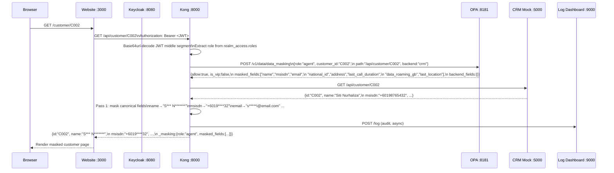
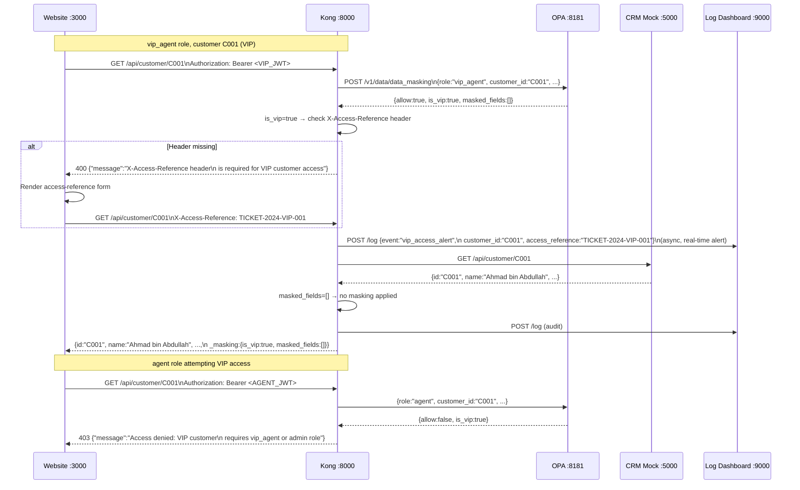
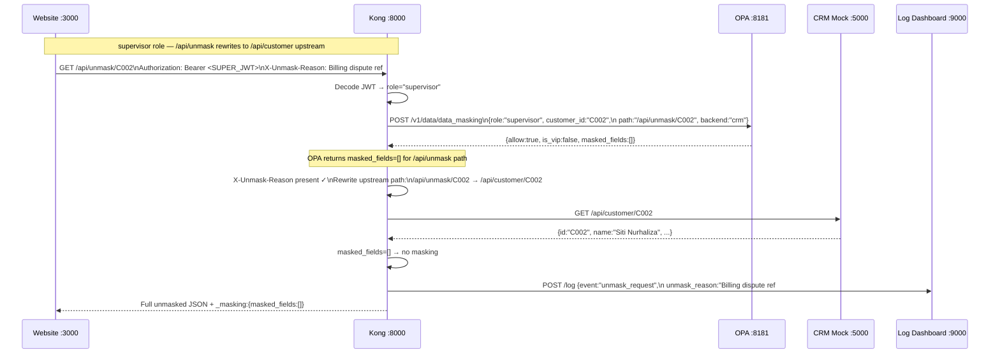
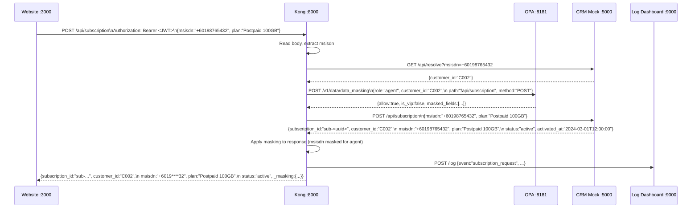
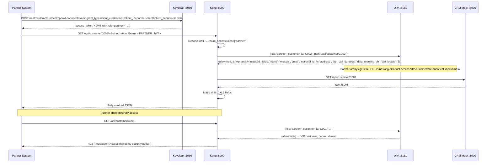

# Data Masking PoC — Keycloak · Kong · OPA · Admin GUI

A self-contained Docker Compose stack demonstrating **role-based PII masking enforced at the API
gateway**, with a live admin console for policy management and multi-backend field alias support.

---

## Table of contents

1. [Architecture](#architecture)
2. [How it works end-to-end](#how-it-works-end-to-end)
3. [Sequence diagrams](#sequence-diagrams)
   - [Standard CRM request](#1-standard-crm-request)
   - [VIP customer access](#2-vip-customer-access)
   - [Unmask request](#3-unmask-request)
   - [Billing subscriber lookup (alias masking)](#4-billing-subscriber-lookup)
   - [Add subscription](#5-add-subscription)
   - [Partner / M2M flow](#6-partner--m2m-flow)
4. [Data classification](#data-classification)
5. [Multi-backend field alias support](#multi-backend-field-alias-support)
6. [Role-based masking policy](#role-based-masking-policy)
7. [VIP customer controls](#vip-customer-controls)
8. [Partner role](#partner-role)
9. [Services](#services)
10. [Quick start](#quick-start)
11. [Demo users](#demo-users)
12. [Test data](#test-data)
13. [API reference](#api-reference)
14. [Sample requests and responses](#sample-requests-and-responses)
15. [OPA policy internals](#opa-policy-internals)
16. [Admin GUI](#admin-gui)
17. [Component map](#component-map)
18. [Startup order](#startup-order)
19. [Production notes](#production-notes)

---

## Architecture

```
┌─────────────────────────────────────────────────────────────────────────┐
│  Browser / API Client                                                   │
│    │  1. OIDC login (auth-code flow) or client_credentials (partner)   │
│    ▼                                                                    │
│  Keycloak :8080  ──  issues signed JWTs with realm_access.roles        │
│                                                                         │
│  Website :3000  (OIDC code flow, Flask)                                 │
│    │  2. Bearer <JWT> on every backend request                          │
│    ▼                                                                    │
│  Kong Gateway :8000  (DB-less, Lua serverless plugins)                 │
│    │  3. Decode JWT locally  — extract role, no KC call per request     │
│    │  4. Resolve MSISDN → customer_id  (CRM internal, if needed)       │
│    │  5. Call OPA with role + customer_id + path + backend             │
│    │       ◄── allow/deny  +  masked_fields  +  is_vip                 │
│    │            +  backend_fields  (field alias registry)              │
│    │  6. Enforce X-Access-Reference for VIP + fire alert               │
│    │  7. Forward request                                                │
│    │       ├─► CRM Mock     :5000  (canonical field names)             │
│    │       └─► Billing Mock :5001  (aliased field names)               │
│    │           ◄── raw JSON                                             │
│    │  8. Two-pass response masking (Lua):                               │
│    │       Pass 1 — canonical field names (msisdn, name, …)            │
│    │       Pass 2 — backend aliases (mobilenum, subname, …)            │
│    │  9. Audit log ─────────────────────────────► Log Dashboard :9000  │
│    ▼                                                                    │
│  Masked JSON → rendered in browser                                      │
│                                                                         │
│  Admin GUI :8888  ──── syncs ──► OPA data API /v1/data/masking_config  │
│    VIP list · role-field matrix · backend field registry               │
│    persisted in SQLite, pushed to OPA on every change                  │
└─────────────────────────────────────────────────────────────────────────┘
```

### Key design decisions

| Decision | Reason |
|---|---|
| JWT decoded locally in Kong | No per-request Keycloak round-trip — lower latency, gateway keeps working if Keycloak is slow |
| OPA for masking decisions | Policy as code, live updates via Admin GUI without gateway restart |
| Admin service as OPA data source | VIP list and masking rules are operational config, not code — owned by ops, not engineers |
| Backend field alias registry | One role × field matrix applies to all backends; alias mapping is data, not code |
| Two-pass Lua masking | Pass 1 for canonical names, Pass 2 for backend-specific aliases with double-masking guard |
| CRM and Billing ports not exposed | All PII access must pass through Kong enforcement |

---

## How it works end-to-end

Every request through Kong goes through a fixed pipeline of three phases.

### Phase 1 — Pre-function (access control, `kong.yml` → `pre-function`)

1. **Extract Bearer token** from `Authorization` header — 401 if missing.
2. **Decode JWT payload** — base64url-decode the middle segment locally. No Keycloak call.
3. **Pick highest-priority role** from `realm_access.roles` (priority: admin > supervisor > vip_agent > agent/partner).
4. **Detect backend** from path prefix (`/api/billing/*` → `"billing"`, everything else → `"crm"`).
5. **Resolve MSISDN → customer_id** (for MSISDN-based routes) by calling CRM's internal `/api/resolve` endpoint. This gives OPA a stable customer_id for the VIP check.
6. **Call OPA** with `{role, username, path, method, customer_id, backend}`. Receive `{allow, masked_fields, is_vip, backend_fields}`.
7. **Enforce VIP rule**: if `is_vip=true` and `X-Access-Reference` header is missing → 400. If present, fire async alert to Log Dashboard.
8. **Enforce unmask rule**: `/api/unmask/*` requires `X-Unmask-Reason` header, then rewrites upstream path to `/api/customer/*`.
9. Store shared context (`masked_fields`, `backend_fields`, `user_role`, `is_vip`, …) in `kong.ctx.shared` for the masking phase.

### Phase 2 — Post-function (response masking, `kong.yml` → `post-function`)

Buffer the full response body, then:

1. **Pass 1** — iterate `MASKERS` (keyed by canonical field name) and mask any field listed in `masked_fields`.
2. **Pass 2** — iterate `backend_fields` (the alias registry returned by OPA). For each entry where `backend_field != canonical_field` and the canonical is in `masked_fields`, apply the same masking function. The `!=` guard prevents double-masking on CRM responses where field names are already canonical.
3. Append `_masking` metadata object to the JSON response.
4. Fire async audit log event.

### Phase 3 — Log (audit trail, `kong.yml` → `post-function.log`)

Fire-and-forget POST to Log Dashboard containing: service, level, event type, path, backend, customer_id, role, OPA decision, masked field count, VIP flag, access reference, and MSISDN hint.

---

## Sequence diagrams

### 1. Standard CRM request



### 2. VIP customer access



### 3. Unmask request



### 4. Billing subscriber lookup

```mermaid
sequenceDiagram
    participant W as Website :3000
    participant K as Kong :8000
    participant OPA as OPA :8181
    participant CRM as CRM Mock :5000
    participant BL as Billing Mock :5001
    participant LD as Log Dashboard :9000

    Note over W,K: agent role — billing backend uses aliased field names

    W->>K: GET /api/billing/subscriber?msisdn=+60198765432\nAuthorization: Bearer <AGENT_JWT>
    K->>K: Detect backend: path starts /api/billing → backend="billing"
    K->>CRM: GET /api/resolve?msisdn=+60198765432\n(internal, best-effort for VIP check)
    CRM-->>K: {customer_id:"C002"}
    K->>OPA: POST /v1/data/data_masking\n{role:"agent", customer_id:"C002",\n backend:"billing", path:"/api/billing/subscriber"}
    OPA-->>K: {allow:true, is_vip:false,\n masked_fields:["name","msisdn",...],\n backend_fields:{\n  "mobilenum":{canonical:"msisdn",classification:"L1"},\n  "subname":{canonical:"name",classification:"L1"},\n  "ic_num":{canonical:"national_id",classification:"L1"},\n  "billing_address":{canonical:"address",classification:"L1"},\n  "call_duration_s":{canonical:"last_call_duration",classification:"L2"},\n  "roaming_gb":{canonical:"data_roaming_gb",classification:"L2"}\n}}
    K->>BL: GET /api/billing/subscriber?msisdn=+60198765432
    BL-->>K: {mobilenum:"+60198765432", subname:"Siti Nurhaliza", ic_num:"920720-10-8812",\n billing_address:"Block 7, Jalan Mawar...", call_duration_s:87, roaming_gb:0.0, ...}
    K->>K: Pass 1: canonical fields — none present in billing response (no "msisdn" key)\nPass 2: aliases — mobilenum→mask_msisdn, subname→mask_name,\n         ic_num→mask_national_id, billing_address→mask_address,\n         call_duration_s→mask_redact, roaming_gb→mask_redact
    K->>LD: POST /log (audit, backend="billing")
    K-->>W: {mobilenum:"+6019****32", subname:"S*** N*******",\n ic_num:"92**************", billing_address:"*** (redacted)",\n call_duration_s:"***", roaming_gb:"***",\n _masking:{backend:"billing", masked_fields:[...]}}
```



### 5. Add subscription



### 6. Partner / M2M flow



---

## Data classification

Fields are classified into two sensitivity levels. OPA returns the list of fields to mask per role;
Kong applies the appropriate masking function.

### L1 — Direct identifiers

| Field (canonical) | Masking function | Example input | Example output |
|---|---|---|---|
| `name` | First letter of each word kept, rest starred | `Ahmad bin Abdullah` | `A**** b** A*******` |
| `msisdn` | Country prefix kept, last 2 digits kept | `+60198765432` | `+6019****32` |
| `email` | First + last char of local part kept | `siti@email.com` | `s***i@email.com` |
| `national_id` | First 2 chars kept | `920720-10-8812` | `92************` |
| `address` | Fully redacted | `Block 7, Jalan Mawar` | `*** (redacted)` |

### L2 — Linkable / profiling data

| Field (canonical) | Masking function | Example output |
|---|---|---|
| `last_call_duration` | Full redact | `***` |
| `data_roaming_gb` | Full redact | `***` |
| `last_location` | Full redact | `***` |

---

## Multi-backend field alias support

Different backend systems may name the same PII concept differently. The alias registry in the
Admin GUI maps backend-specific field names to canonical names, allowing the same role × field
masking matrix to apply across all backends.

### How it works

```
Admin GUI
  └─ field_mappings table (SQLite)
       billing/mobilenum → canonical:msisdn, L1
       billing/subname   → canonical:name,   L1
       ...
       │
       ▼ pushed to OPA via /v1/data/masking_config
OPA policy.rego
  └─ backend_fields rule
       input.backend = "billing"
       → returns {mobilenum:{canonical:"msisdn",...}, subname:{canonical:"name",...}, ...}
       │
       ▼ returned in OPA response
Kong post-function
  └─ Pass 1: mask data["msisdn"] if present
     Pass 2: for each alias where canon != bfield
               if data["mobilenum"] present and "msisdn" in masked_fields
                 apply mask_msisdn to data["mobilenum"]
```

### Registered backends (defaults)

| Backend ID | Display name | Base URL | Notes |
|---|---|---|---|
| `crm` | CRM System | `http://crm-mock:5000` | Canonical field names — Pass 2 has no effect |
| `billing` | Billing System | `http://billing-mock:5001` | Aliased field names — Pass 2 handles these |

### Billing field alias map

| Billing field | Canonical field | Classification |
|---|---|---|
| `mobilenum` | `msisdn` | L1 |
| `subname` | `name` | L1 |
| `ic_num` | `national_id` | L1 |
| `billing_address` | `address` | L1 |
| `call_duration_s` | `last_call_duration` | L2 |
| `roaming_gb` | `data_roaming_gb` | L2 |

Adding a new backend only requires registering its field mappings in the Admin GUI. No OPA policy
changes, no Kong plugin changes.

---

## Role-based masking policy

Masking rules are live-configurable via the Admin GUI. The defaults:

| Field | Class | agent | supervisor | vip\_agent | admin | partner |
|---|:---:|:---:|:---:|:---:|:---:|:---:|
| `name` | L1 | masked | clear | clear | clear | masked |
| `msisdn` | L1 | masked | masked | clear | clear | masked |
| `email` | L1 | masked | clear | clear | clear | masked |
| `national_id` | L1 | masked | masked | clear | clear | masked |
| `address` | L1 | masked | clear | clear | clear | masked |
| `last_call_duration` | L2 | masked | clear | clear | clear | masked |
| `data_roaming_gb` | L2 | masked | clear | clear | clear | masked |
| `last_location` | L2 | masked | clear | clear | clear | masked |

---

## VIP customer controls

Customers `C001` (Ahmad) and `C004` (Mei Ling) are flagged as VIP. Stronger controls apply:

| Role | VIP access |
|---|---|
| `agent` | 403 — blocked entirely |
| `supervisor` | 403 — blocked entirely |
| `vip_agent` | Allowed — must supply `X-Access-Reference` header on every request |
| `admin` | Allowed — must supply `X-Access-Reference` header on every request |
| `partner` | 403 — blocked entirely (M2M partners cannot access VIP data) |

- **Real-time alert**: Kong fires a `vip_access_alert` event to the Log Dashboard immediately, before forwarding the request upstream.
- **Audit trail**: Every VIP access is logged with username, role, reference, customer ID, and timestamp.
- **Live config**: The VIP list is managed in the Admin GUI and takes effect on the next request — no restart needed.

---

## Partner role

The `partner` client uses **client credentials flow** (M2M — no human login). It receives full
L1 + L2 masking on every field and has no path to unmask data.

```bash
# Obtain a partner token (client credentials)
PARTNER_TOKEN=$(curl -s -X POST \
  http://localhost:8080/realms/demo/protocol/openid-connect/token \
  -d "client_id=partner-client&client_secret=partner-secret-456" \
  -d "grant_type=client_credentials" \
  | jq -r .access_token)

# Partner request — all PII masked
curl -s -H "Authorization: Bearer $PARTNER_TOKEN" \
  http://localhost:8000/api/customer/C002 | jq
```

Rules enforced at the OPA layer (cannot be bypassed even with valid tokens):
- VIP customers → 403
- `/api/unmask/*` → 403 (partner is excluded from the `allow` rule for unmask)
- Full L1+L2 masking always applied

---

## Services

| Service | URL | Purpose |
|---|---|---|
| Website | http://localhost:3000 | Agent-facing CRM portal (OIDC login, search, VIP flow) |
| Keycloak | http://localhost:8080 | Identity provider — OIDC, JWT issuer |
| Kong Gateway | http://localhost:8000 | API gateway — JWT decode, OPA, masking, audit |
| Kong Admin | http://localhost:8001 | Kong admin API (read-only metrics / config inspection) |
| OPA | http://localhost:8181 | Policy engine |
| Admin GUI | http://localhost:8888 | Live policy configuration (VIP, roles, backends) |
| Log Dashboard | http://localhost:9000 | Real-time audit log viewer |
| CRM Mock | internal only | Raw customer data — canonical PII field names |
| Billing Mock | internal only | Raw subscriber data — aliased PII field names |

---

## Quick start

```bash
git clone <repo>
cd Data-Masking
docker compose up --build
```

First boot takes **2–3 minutes** — Keycloak must finish importing the `demo` realm and the Admin
Service must seed the database and push config to OPA before Kong starts. Docker Compose enforces
the startup order via healthchecks.

Once all containers are up, open **http://localhost:3000**.

---

## Demo users

| Username | Password | Role | Notes |
|---|---|---|---|
| `agent1` | `agent123` | agent | Full L1+L2 masking; VIP blocked |
| `supervisor1` | `super123` | supervisor | L1 partial (msisdn + national_id masked); VIP blocked |
| `vip1` | `vip123` | vip\_agent | No masking; VIP allowed with access reference |
| `admin1` | `admin123` | admin | No masking; VIP allowed with access reference |

**Admin GUI**: http://localhost:8888 — `admin / admin123`

---

## Test data

### CRM customers (canonical field names)

| ID | Name | MSISDN | VIP | Notes |
|---|---|---|---|---|
| C001 | Ahmad bin Abdullah | +60123456789 | Yes | Requires access reference |
| C002 | Siti Nurhaliza binti Tarudin | +60198765432 | No | Standard access |
| C003 | Rajesh Kumar Sharma | +60112233445 | No | Suspended account |
| C004 | Mei Ling Tan | +60167890123 | Yes | Requires access reference |

### Billing subscribers (aliased field names)

Same 4 people, exposed by the billing backend with different field names:

| MSISDN | `subname` | `mobilenum` | Plan | Outstanding |
|---|---|---|---|---|
| +60123456789 | Ahmad bin Abdullah | +60123456789 | PP100 (Postpaid 100GB) | 0.00 |
| +60198765432 | Siti Nurhaliza binti Tarudin | +60198765432 | PRE20 (Prepaid 20GB) | 5.50 |
| +60112233445 | Rajesh Kumar Sharma | +60112233445 | PP50 (Postpaid 50GB) | 118.00 |
| +60167890123 | Mei Ling Tan | +60167890123 | PP200 (Postpaid 200GB) | 0.00 |

---

## API reference

All endpoints require `Authorization: Bearer <token>`.

| Method | Path | Backend | Description |
|---|---|---|---|
| GET | `/api/customer/{id}` | CRM | Fetch customer by ID — fields masked per role |
| GET | `/api/customer?msisdn={msisdn}` | CRM | Fetch customer by MSISDN (Kong resolves → customer_id) |
| GET | `/api/unmask/{id}` | CRM | Fetch fully unmasked record (requires `X-Unmask-Reason`) |
| GET | `/api/billing/subscriber?msisdn={msisdn}` | Billing | Fetch billing subscriber — aliases masked per role |
| POST | `/api/subscription` | CRM | Add a subscription (body: `{msisdn, plan}`) |

### Request headers

| Header | When required |
|---|---|
| `Authorization: Bearer <token>` | All requests |
| `X-Unmask-Reason: <reason>` | `/api/unmask/*` only |
| `X-Access-Reference: <ticket>` | Any request for a VIP customer |

---

## Sample requests and responses

Enable direct grants for CLI testing by adding `"directAccessGrantsEnabled": true` in
`keycloak/realm-config.json` for `website-client`, then `docker compose up --build`.

```bash
# ── Obtain tokens ──────────────────────────────────────────────────────────────
AGENT_TOKEN=$(curl -s -X POST \
  http://localhost:8080/realms/demo/protocol/openid-connect/token \
  -d "client_id=website-client&client_secret=website-secret-123" \
  -d "username=agent1&password=agent123&grant_type=password" \
  | jq -r .access_token)

VIP_TOKEN=$(curl -s -X POST \
  http://localhost:8080/realms/demo/protocol/openid-connect/token \
  -d "client_id=website-client&client_secret=website-secret-123" \
  -d "username=vip1&password=vip123&grant_type=password" \
  | jq -r .access_token)

PARTNER_TOKEN=$(curl -s -X POST \
  http://localhost:8080/realms/demo/protocol/openid-connect/token \
  -d "client_id=partner-client&client_secret=partner-secret-456" \
  -d "grant_type=client_credentials" \
  | jq -r .access_token)
```

---

### GET /api/customer/C002 — agent role

```bash
curl -s -H "Authorization: Bearer $AGENT_TOKEN" \
  http://localhost:8000/api/customer/C002 | jq
```

**Response (200)**
```json
{
  "id": "C002",
  "name": "S*** N********* b**** T******",
  "msisdn": "+6019****32",
  "email": "s***i@email.com",
  "national_id": "92************",
  "address": "*** (redacted)",
  "plan": "Prepaid 20GB",
  "status": "active",
  "last_call_duration": "***",
  "data_roaming_gb": "***",
  "last_location": "***",
  "_masking": {
    "applied": true,
    "role": "agent",
    "masked_fields": ["name", "msisdn", "email", "national_id", "address",
                      "last_call_duration", "data_roaming_gb", "last_location"],
    "gateway": "kong-opa",
    "is_vip": false,
    "backend": "crm"
  }
}
```

---

### GET /api/customer/C002 — supervisor role

```bash
SUPER_TOKEN=$(curl -s -X POST \
  http://localhost:8080/realms/demo/protocol/openid-connect/token \
  -d "client_id=website-client&client_secret=website-secret-123" \
  -d "username=supervisor1&password=super123&grant_type=password" \
  | jq -r .access_token)

curl -s -H "Authorization: Bearer $SUPER_TOKEN" \
  http://localhost:8000/api/customer/C002 | jq
```

**Response (200)** — supervisor sees name, email, address; msisdn and national_id still masked
```json
{
  "id": "C002",
  "name": "Siti Nurhaliza binti Tarudin",
  "msisdn": "+6019****32",
  "email": "siti@email.com",
  "national_id": "92************",
  "address": "Block 7, Jalan Mawar, 40150 Shah Alam",
  "plan": "Prepaid 20GB",
  "status": "active",
  "last_call_duration": 87,
  "data_roaming_gb": 0.0,
  "last_location": "Shah Alam",
  "_masking": {
    "applied": true,
    "role": "supervisor",
    "masked_fields": ["msisdn", "national_id"],
    "gateway": "kong-opa",
    "is_vip": false,
    "backend": "crm"
  }
}
```

---

### GET /api/customer/C001 — agent blocked on VIP

```bash
curl -s -H "Authorization: Bearer $AGENT_TOKEN" \
  http://localhost:8000/api/customer/C001 | jq
```

**Response (403)**
```json
{
  "error": true,
  "message": "Access denied: VIP customer requires vip_agent or admin role"
}
```

---

### GET /api/customer/C001 — vip_agent with access reference

```bash
# Missing header — Kong blocks before calling upstream
curl -s -H "Authorization: Bearer $VIP_TOKEN" \
  http://localhost:8000/api/customer/C001 | jq
```

**Response (400)**
```json
{
  "error": true,
  "message": "X-Access-Reference header is required for VIP customer access"
}
```

```bash
# With access reference — full unmasked data (vip_agent has empty masked_fields)
curl -s \
  -H "Authorization: Bearer $VIP_TOKEN" \
  -H "X-Access-Reference: TICKET-2024-VIP-001" \
  http://localhost:8000/api/customer/C001 | jq
```

**Response (200)**
```json
{
  "id": "C001",
  "name": "Ahmad bin Abdullah",
  "msisdn": "+60123456789",
  "email": "ahmad@example.com",
  "national_id": "850315-14-5678",
  "address": "No. 12, Jalan Ampang, 50450 Kuala Lumpur",
  "plan": "Postpaid 100GB",
  "status": "active",
  "last_call_duration": 342,
  "data_roaming_gb": 1.2,
  "last_location": "Kuala Lumpur",
  "_masking": {
    "applied": true,
    "role": "vip_agent",
    "masked_fields": [],
    "gateway": "kong-opa",
    "is_vip": true,
    "backend": "crm"
  }
}
```

---

### GET /api/unmask/C002 — supervisor role

```bash
curl -s \
  -H "Authorization: Bearer $SUPER_TOKEN" \
  -H "X-Unmask-Reason: Billing dispute ref #4521" \
  http://localhost:8000/api/unmask/C002 | jq
```

**Response (200)** — OPA returns `masked_fields=[]` for `/api/unmask` path
```json
{
  "id": "C002",
  "name": "Siti Nurhaliza binti Tarudin",
  "msisdn": "+60198765432",
  "email": "siti@email.com",
  "national_id": "920720-10-8812",
  "address": "Block 7, Jalan Mawar, 40150 Shah Alam",
  "plan": "Prepaid 20GB",
  "status": "active",
  "last_call_duration": 87,
  "data_roaming_gb": 0.0,
  "last_location": "Shah Alam",
  "_masking": {
    "applied": true,
    "role": "supervisor",
    "masked_fields": [],
    "gateway": "kong-opa",
    "is_vip": false,
    "backend": "crm"
  }
}
```

**Without X-Unmask-Reason (400)**
```json
{
  "error": true,
  "message": "X-Unmask-Reason header is required for data unmasking"
}
```

---

### GET /api/billing/subscriber — agent role (alias masking)

```bash
curl -s \
  -H "Authorization: Bearer $AGENT_TOKEN" \
  "http://localhost:8000/api/billing/subscriber?msisdn=+60198765432" | jq
```

**Response (200)** — billing aliases masked via Pass 2; non-PII fields (account_type, outstanding_bill, …) are untouched
```json
{
  "mobilenum": "+6019****32",
  "subname": "S*** N**** b*** T******",
  "ic_num": "92**************",
  "billing_address": "*** (redacted)",
  "account_type": "prepaid",
  "plan_code": "PRE20",
  "outstanding_bill": 5.5,
  "last_bill_date": "2024-02-28",
  "data_usage_gb": 18.1,
  "call_duration_s": "***",
  "roaming_gb": "***",
  "_masking": {
    "applied": true,
    "role": "agent",
    "masked_fields": ["name", "msisdn", "email", "national_id", "address",
                      "last_call_duration", "data_roaming_gb", "last_location"],
    "gateway": "kong-opa",
    "is_vip": false,
    "backend": "billing"
  }
}
```

---

### POST /api/subscription — add subscription

```bash
curl -s -X POST \
  -H "Authorization: Bearer $AGENT_TOKEN" \
  -H "Content-Type: application/json" \
  -d '{"msisdn": "+60198765432", "plan": "Postpaid 100GB"}' \
  http://localhost:8000/api/subscription | jq
```

**Response (200)**
```json
{
  "subscription_id": "sub-3a7f2b1c-9e4d-48a0-b123-dc9a0e7f1234",
  "customer_id": "C002",
  "msisdn": "+6019****32",
  "plan": "Postpaid 100GB",
  "status": "active",
  "activated_at": "2024-03-01T12:34:56",
  "_masking": {
    "applied": true,
    "role": "agent",
    "masked_fields": ["name", "msisdn", "email", "national_id", "address",
                      "last_call_duration", "data_roaming_gb", "last_location"],
    "gateway": "kong-opa",
    "is_vip": false,
    "backend": "crm"
  }
}
```

---

### Partner — full L1+L2 masking (M2M)

```bash
curl -s -H "Authorization: Bearer $PARTNER_TOKEN" \
  http://localhost:8000/api/customer/C002 | jq
```

**Response (200)** — all 8 L1+L2 fields masked, same as agent
```json
{
  "id": "C002",
  "name": "S*** N********* b**** T******",
  "msisdn": "+6019****32",
  "email": "s***i@email.com",
  "national_id": "92************",
  "address": "*** (redacted)",
  "plan": "Prepaid 20GB",
  "status": "active",
  "last_call_duration": "***",
  "data_roaming_gb": "***",
  "last_location": "***",
  "_masking": {
    "applied": true,
    "role": "partner",
    "masked_fields": ["name", "msisdn", "email", "national_id", "address",
                      "last_call_duration", "data_roaming_gb", "last_location"],
    "gateway": "kong-opa",
    "is_vip": false,
    "backend": "crm"
  }
}
```

---

## OPA policy internals

**Policy file**: `opa/policy.rego`

OPA runs in **v0-compatible mode** (`--v0-compatible`). The masking config is not baked into
the policy — it is pushed at runtime by the Admin Service via `PUT /v1/data/masking_config`.

### Data shape pushed by admin-service

```json
{
  "vip_customers": {
    "C001": true,
    "C004": true
  },
  "role_masked_fields": {
    "agent":      ["name", "msisdn", "email", "national_id", "address",
                   "last_call_duration", "data_roaming_gb", "last_location"],
    "supervisor": ["msisdn", "national_id"],
    "vip_agent":  [],
    "admin":      [],
    "partner":    ["name", "msisdn", "email", "national_id", "address",
                   "last_call_duration", "data_roaming_gb", "last_location"]
  },
  "backends": {
    "crm": {
      "msisdn":             {"canonical": "msisdn",             "classification": "L1"},
      "name":               {"canonical": "name",               "classification": "L1"}
    },
    "billing": {
      "mobilenum":          {"canonical": "msisdn",             "classification": "L1"},
      "subname":            {"canonical": "name",               "classification": "L1"},
      "ic_num":             {"canonical": "national_id",        "classification": "L1"},
      "billing_address":    {"canonical": "address",            "classification": "L1"},
      "call_duration_s":    {"canonical": "last_call_duration", "classification": "L2"},
      "roaming_gb":         {"canonical": "data_roaming_gb",    "classification": "L2"}
    }
  }
}
```

### Key rules

```rego
# Allow regular roles only for non-VIP customers
allow {
    input.role == "agent"
    not vip_customers[input.customer_id]
}

# Partner: allowed for non-VIP, non-unmask paths
allow {
    input.role == "partner"
    not vip_customers[input.customer_id]
    not startswith(input.path, "/api/unmask")
}

# masked_fields = [] on the unmask path (caller explicitly requested full data)
masked_fields = [] {
    startswith(input.path, "/api/unmask")
}

# backend_fields returns the alias registry for the requesting backend
backend_fields = f {
    f := data.masking_config.backends[input.backend]
}
```

### OPA input / output contract

**Input (Kong → OPA)**
```json
{
  "input": {
    "role":        "agent",
    "username":    "agent1",
    "path":        "/api/customer/C002",
    "method":      "GET",
    "customer_id": "C002",
    "backend":     "crm"
  }
}
```

**Output (OPA → Kong)** — `result` key
```json
{
  "result": {
    "allow":          true,
    "is_vip":         false,
    "masked_fields":  ["name", "msisdn", "email", "national_id", "address",
                       "last_call_duration", "data_roaming_gb", "last_location"],
    "backend_fields": {
      "msisdn": {"canonical": "msisdn", "classification": "L1"},
      "name":   {"canonical": "name",   "classification": "L1"}
    }
  }
}
```

---

## Admin GUI

Open **http://localhost:8888** and log in with `admin / admin123`.

| Page | Path | What you can do |
|---|---|---|
| Dashboard | `/` | Summary cards: VIP count, active mask rules, role count, backend count, OPA sync status |
| VIP Customers | `/vip` | Add or remove VIP customer IDs — syncs to OPA immediately |
| Masking Rules | `/roles` | Checkbox matrix of role × field — save pushes live to OPA |
| Backends | `/backends` | Register backends, add/remove field alias mappings |
| Sync OPA | POST `/sync` | Force re-push of all config (use after OPA restart) |
| Live config | GET `/api/config` | JSON view of the exact payload currently in OPA |

**Changes take effect on the next request — no gateway or policy engine restart needed.**

---

## Component map

```
.
├── docker-compose.yml          Service wiring, healthchecks, startup ordering
│
├── keycloak/
│   └── realm-config.json       Auto-imported realm: users (agent1, supervisor1,
│                               vip1, admin1), roles, clients (website-client,
│                               partner-client), service account for partner
│
├── opa/
│   └── policy.rego             Access + masking policy (v0 syntax)
│                               References data.masking_config (pushed by
│                               admin-service at startup and on each change)
│
├── kong/
│   └── kong.yml                DB-less declarative config
│                               ├─ services: crm-service, billing-service
│                               ├─ routes: customer, unmask, subscription, billing
│                               └─ plugins (global):
│                                   cors         — CORS headers
│                                   pre-function — JWT decode, MSISDN resolve,
│                                                  OPA call, VIP/unmask enforce
│                                   post-function — two-pass masking + audit log
│
├── admin-service/
│   ├── app.py                  Flask + SQLite CRUD
│   │                           Tables: fields, vip_customers, role_masked_fields,
│   │                                   backends, field_mappings, sync_log
│   │                           Pushes to OPA /v1/data/masking_config on every change
│   └── templates/
│       ├── base.html           Bootstrap 5 nav shell
│       ├── dashboard.html      5-card summary + masking matrix + sync log
│       ├── vip.html            VIP customer management
│       ├── roles.html          Role × field checkbox matrix
│       └── backends.html       Backend registry + field alias accordion
│
├── crm-mock/
│   └── app.py                  Flask mock, 4 customers (C001–C004)
│                               Canonical field names: name, msisdn, email,
│                               national_id, address, last_call_duration,
│                               data_roaming_gb, last_location
│                               Endpoints: /health, /api/customer/{id},
│                               /api/customer?msisdn=, /api/resolve?msisdn=,
│                               POST /api/subscription
│
├── billing-mock/
│   └── app.py                  Flask mock, same 4 customers via MSISDN
│                               Aliased field names: mobilenum, subname, ic_num,
│                               billing_address, call_duration_s, roaming_gb
│                               Non-PII: account_type, plan_code, outstanding_bill,
│                               last_bill_date, data_usage_gb
│                               Endpoints: /health, /api/billing/subscriber?msisdn=
│
├── website/
│   ├── app.py                  Flask portal: OIDC auth code flow, customer by ID,
│   │                           customer by MSISDN, billing subscriber by MSISDN,
│   │                           reveal (unmask), add subscription
│   └── templates/
│       ├── base.html           Bootstrap 5 shell + Bootstrap JS bundle
│       ├── index.html          Landing / login page
│       ├── search.html         Three-card search: customer ID, CRM MSISDN,
│       │                       Billing MSISDN; quick-access test customer cards
│       ├── customer.html       CRM customer detail: masked fields, VIP gate,
│       │                       unmask panel, add-subscription panel
│       └── subscriber.html     Billing subscriber detail: aliased fields with
│                               canonical mapping + L1/L2 badges
│
└── log-dashboard/
    └── app.py                  Flask SSE receiver — real-time audit log viewer
                                Receives events from Kong, website, CRM mock,
                                billing mock; persists to in-memory list
```

---

## Startup order

Docker Compose enforces this sequence:

```
log-dashboard (healthy)
  ├─► crm-mock    (healthy)
  ├─► billing-mock (healthy)
  └─► admin-service (healthy — seeds DB, syncs config to OPA)
        └─► kong (started — OPA data ready before first request)

keycloak (started — realm import completes asynchronously)
  └─► website (started — retries login redirect until Keycloak realm is ready)
```

Kong will not start until Admin Service is healthy, guaranteeing OPA always has masking rules
loaded before the first request. Keycloak and the Website use `restart: on-failure` to handle
the realm import timing.

---

## Production notes

**JWT signature verification**: The demo decodes the JWT payload locally (base64url only — no
signature check). In production, add Kong's built-in `jwt` plugin before the pre-function.
The `jwt` plugin verifies the signature against Keycloak JWKS; the pre-function then reads the
already-validated claims. No Lua code changes required.

**OPA persistence**: OPA holds masking config in memory. On restart, the Admin Service must
re-sync — use the Dashboard "Sync OPA" button or `POST /sync`. For production, use OPA
[bundle mode](https://www.openpolicyagent.org/docs/latest/management-bundles/) for versioned,
persistent policy distribution.

**Secrets**: Client secrets and admin passwords are hardcoded for demo convenience. In
production, inject via a secrets manager (e.g. Vault, AWS Secrets Manager) and rotate regularly.

**Admin service database**: SQLite suits single-instance demos. In production, replace with
Postgres and enable proper backup and WAL-mode write durability. The `sync_log` table also
serves as an audit trail for policy changes.

**Backend MSISDN resolution**: Kong calls CRM `/api/resolve?msisdn=` synchronously on every
MSISDN-based request to get the customer_id for the OPA VIP check. For billing subscribers,
resolution is best-effort (no CRM record → `customer_id=""` → treated as non-VIP). Cache this
lookup in production if CRM latency is a concern.
